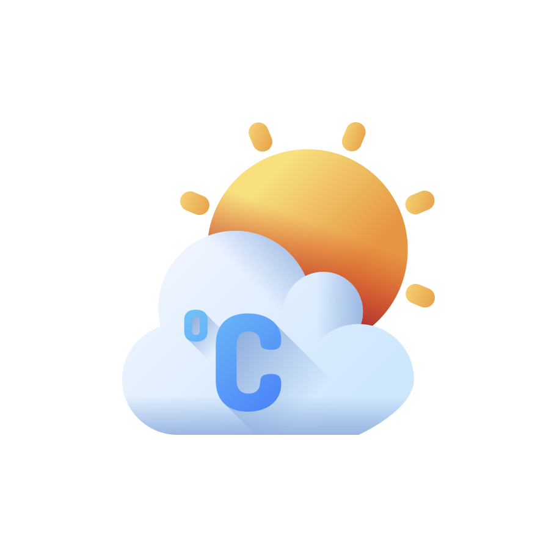

# 🌦 Weezy – Weather Forecast App

<p align="center">
  
</p>

<p align="center">
  <strong>Real-time weather forecasts, smart alerts, and location-based insights.</strong>
</p>

<p align="center">
  <a href="#overview">Overview</a> •
  <a href="#features">Features</a> •
  <a href="#screenshots">Screenshots</a> •
  <a href="#architecture">Architecture</a> •
  <a href="#tech-stack">Tech Stack</a>
</p>

---

## 📋 Overview

Weezy is a modern Android Weather Forecast application developed as part of the  
**ITI (Information Technology Institute) 9-Month Mobile Application Development – Native Android Program**.

The application follows production-grade Android development standards using **MVVM architecture** and modern Android libraries.

It demonstrates:

- Clean layered architecture
- Advanced state handling in Jetpack Compose
- Background scheduling with WorkManager & AlarmManager
- Offline-first persistence with Room
- Multi-language support
- Unit testing & testable business logic

---

## ✨ Features

| Feature | Description |
|----------|------------|
| 🌡 **Current Weather** | Real-time temperature, humidity, pressure, wind speed, and cloud coverage |
| 🕒 **Hourly Forecast** | Detailed hourly breakdown for the current day |
| 📅 **5-Day Forecast** | Extended multi-day weather outlook |
| ⭐ **Favorites** | Save and manage multiple locations |
| 🗺 **Map Selection** | Choose locations directly from Google Maps |
| 📍 **GPS Support** | Detect current location automatically |
| 🌍 **Multi-Language** | Supports multiple languages |
| 🔔 **Weather Alerts** | Custom notifications or alarm-based weather alerts |
| ⚙ **Custom Units** | Kelvin, Celsius, Fahrenheit + multiple wind speed units |

---

## 📱 Screenshots

### 🏠 Home


### ⭐ Favorites


### ⚙ Maps


### ⚙ Settings


### ⏰ Alerts


---

## 🏗 Architecture

This project implements **MVVM (Model–View–ViewModel)** with clear separation of concerns:
Presentation Layer (Jetpack Compose UI + ViewModels)
↓
Repository Layer (Single Source of Truth)
↓
Local (Room) + Remote (Retrofit API)


### Architectural Highlights

- Repository pattern
- DTO → Domain model mapping
- Coroutines for async operations
- Lifecycle-aware state management
- Background work scheduling
- Testable ViewModels

---

## 📂 Project Structure

```plaintext
com.dmy.weather
│
├── data
│   ├── data_source
│   ├── db
│   ├── network
│   ├── enums
│   ├── dto
│   ├── mapper
│   ├── model
│   └── repo
│
├── di
│
├── platform
│
└── presentation
    ├── alerts_screen
    ├── app_bar
    ├── components
    ├── favorites_screen
    ├── home_screen
    ├── language_selection_screen
    ├── location_search_screen
    ├── my_app
    ├── permissions
    ├── settings_screen
    ├── splash_screen
    ├── utils
    └── weather_details_screen
```
## 🛠️ Tech Stack

| Category                 | Technology                                       |
| ------------------------ | ------------------------------------------------ |
| **Language**             | Kotlin                                           |
| **Platform**             | Android SDK (Min SDK 26, Target SDK 36)          |
| **Architecture**         | MVVM (Model–View–ViewModel) + Clean Architecture |
| **UI**                   | Jetpack Compose + Material 3                     |
| **State Management**     | ViewModel + StateFlow                            |
| **Asynchronous**         | Kotlin Coroutines + Flow                         |
| **Local Database**       | Room Database                                    |
| **Preferences**          | DataStore                                        |
| **Network**              | Retrofit 2 + Gson Converter                      |
| **Dependency Injection** | Koin                                             |
| **Background Work**      | WorkManager + AlarmManager                       |
| **Maps & Location**      | Google Maps Compose + Location Services          |
| **Testing**              | JUnit, Robolectric, MockK                        |

 
## 🌍 API Reference

Weather data is fetched from:
https://api.openweathermap.org/data/2.5/forecast

### 📦 SDK Configuration

- compileSdk: 36

- targetSdk: 36

- minSdk: 26

---

## 👨‍💻 Author

**Mahmoud ELDemerdash**

[](https://github.com/ELDemy)
[](https://linkedin.com/in/ELDemy)


